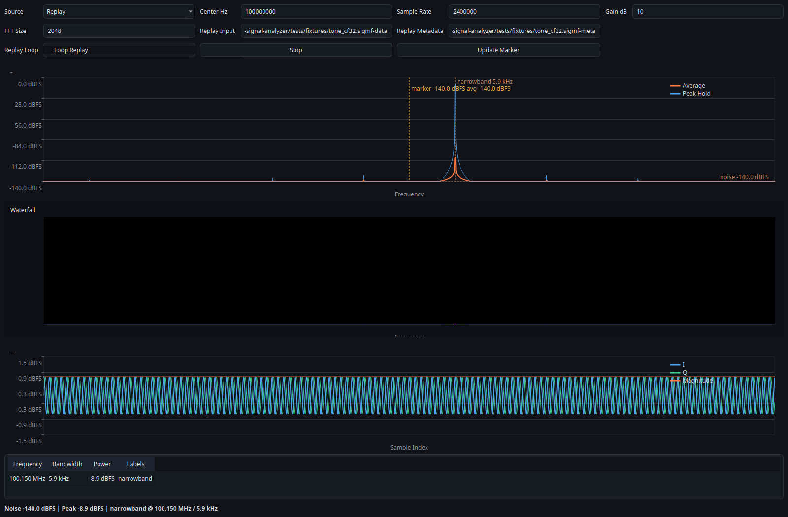

# SDR Signal Analyzer

[](https://github.com/schmijul/sdr-signal-analyzer/actions/workflows/ci.yml)
[](https://github.com/schmijul/sdr-signal-analyzer/actions/workflows/docs.yml)
[](https://github.com/schmijul/sdr-signal-analyzer/blob/main/pyproject.toml)

Deterministic SDR analysis backend for reproducible signal inspection.

This is not a demodulator and not a full SDR stack.
It is a deterministic analysis backend for reproducible workflows.

## What You Get

- reproducible signal analysis
- scriptable CLI
- embeddable core
- testable pipelines

## What You Don't Get

- real-time DSP stack
- demodulation
- production SDR control layer

## Why This Exists

The project exists for workflows where replayability matters more than live tuning convenience. CLI, GUI, and Python bindings all sit on the same analysis pipeline, so tests, automation, and manual inspection use the same backend behavior.

## Why This Instead Of Existing Tools?

| Tool | Focus | Limitation |
| --- | --- | --- |
| Inspectrum | GUI analysis | no automation, no backend |
| GQRX | live SDR | non-deterministic, not testable |
| This project | backend + replay | not a full SDR stack |

## 3-Minute Example

```bash
sdr-analyzer-cli \
  --source replay \
  --input tests/fixtures/tone_cf32.sigmf-data \
  --meta tests/fixtures/tone_cf32.sigmf-meta \
  --frames 4
```

Expected result:
- deterministic detection near `100.15 MHz`
- same replay fixture, same signal metrics on every run

See [docs/proof.md](docs/proof.md) for the repo-backed evidence path.

Want the GUI first instead of the CLI?

```bash
sdr-signal-analyzer-gui
```

The GUI starts with the simulator profile selected by default, so no hardware setup is required for a first run.

## Example Output



## Features

- deterministic replay of committed IQ fixtures
- shared analysis pipeline across CLI, GUI, and Python bindings
- embeddable C++ core with Python packaging via `scikit-build-core`
- JSONL export for structured measurements
- simulator-first workflow for development and CI
- optional live sources for `rtl_tcp`, UHD, and SoapySDR

## Architecture

- sources feed IQ frames into one analyzer pipeline
- the session layer owns orchestration, diagnostics, and export
- CLI, GUI, and Python APIs consume the same backend results

More detail:
- [Architecture](docs/architecture.md)
- [Replay and Recording](docs/replay-and-recording.md)
- [Source Guides](docs/sources/index.md)

## Status And Validation

### Hardware Status

- Replay: fully verified in-repo
- `rtl_tcp`: code path verified in CI with a mock server
- UHD / Soapy: not yet validated on attached hardware

See [docs/proof.md](docs/proof.md) for concrete evidence and [docs/hardware_validation_status.md](docs/hardware_validation_status.md) for backend status detail.

Current validation signal:
- deterministic replay fixtures are committed under [`tests/fixtures`](tests/fixtures)
- native tests and Python smoke tests run in CI
- docs build in strict mode
- attached-device evidence is still pending and is intentionally documented as such

## Roadmap

- [ ] first committed attached-device validation report
- [ ] UHD validation
- [ ] multi-device support
- [ ] performance benchmarks

## Install

From source today:

```bash
sudo apt install -y cmake g++ libegl1 libxcb-cursor0 libxkbcommon-x11-0 ninja-build python3-dev
python -m pip install ".[gui]"
```

Package metadata and release automation are already configured for the `sdr-signal-analyzer` package name in [`pyproject.toml`](pyproject.toml).

## Documentation

- [Documentation home](https://schmijul.github.io/sdr-signal-analyzer/)
- [Proof page](docs/proof.md)
- [Testing and validation](docs/testing.md)
- [Diagnostics](docs/diagnostics.md)
- [Release readiness](docs/release.md)
