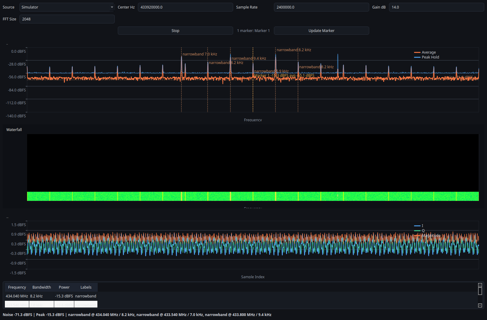
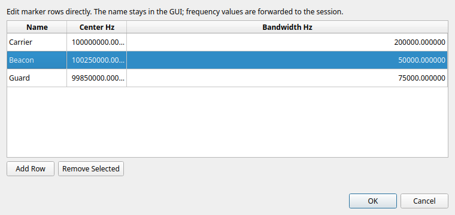
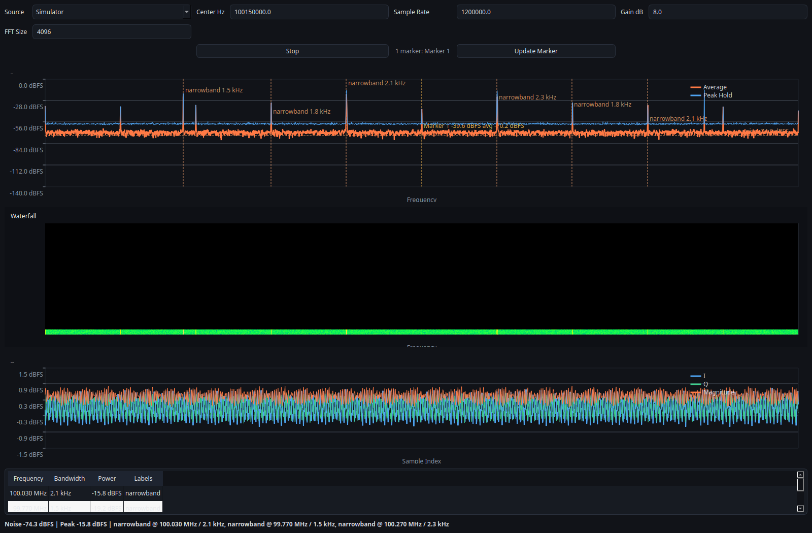

# Case Studies And Screenshots

## Scope

This file explains what the current screenshots and fixtures prove.

Important distinction:
- the committed screenshots are simulator-generated unless stated otherwise
- the committed replay fixtures are synthetic narrowband test captures
- these assets prove reproducibility and pipeline behavior, not calibrated RF truth

## Overview UI


*Full spectrum, waterfall, time-domain view, and detection table from the offscreen simulator GUI. This is a reproducible documentation asset, not live RF validation.*

What it proves:
- the GUI is fully driven by the backend snapshot API
- the analyzer can display multiple signal-like structures simultaneously
- the docs/screenshots are reproducible from code, not hand-edited assets
- the same backend path can power both the GUI and the CLI

Status:
- provenance: `simulator`
- evidence class: `Verified` for GUI reproducibility

## 433 MHz Style Scene



*A simulator-backed scene centered around 433.92 MHz for portfolio and layout coverage. It is illustrative only and does not validate live RF conditions.*

What it proves:
- the UI handles alternate center frequencies and marker placement cleanly
- the portfolio can present sub-GHz workflows in a reproducible way
- the simulator path is useful for documentation and quick demos

Status:
- provenance: `simulator`
- evidence class: `Verified` for documentation reproducibility

What it does not prove:
- this is not a real over-the-air ISM capture
- this does not validate the analyzer against live RF conditions

## Marker Editor



*The table-based marker editor used to add, remove, and rename markers before applying them to the session.*

What it proves:
- the GUI can expose marker management in a dedicated modal dialog
- marker names stay human-readable in the UI while the backend still receives the numeric marker spans
- row-based editing is easier to document than the old inline fields

Status:
- provenance: `simulator`
- evidence class: `Verified` for GUI interaction coverage

## Narrowband Fixture



*A simulator-backed narrowband view used to show a tighter frequency span and marker measurement layout. It is reproducible and illustrative, not calibrated instrumentation.*

Related fixtures:
- `tests/fixtures/tone_cf32.bin`
- `tests/fixtures/tone_cf32.bin.json`
- `tests/fixtures/tone_cf32.sigmf-data`
- `tests/fixtures/tone_cf32.sigmf-meta`

What it shows:
- a deterministic narrowband tone around 100.15 MHz
- replayable input suitable for regression tests

What it proves:
- replay analysis is deterministic
- raw and SigMF paths both support the same basic narrowband example
- bandwidth estimation and marker measurement can be validated against a known synthetic signal, within the limits described in the trust page
- CLI replay prints repeatable detections for the same capture

Status:
- provenance: `replay fixture`
- evidence class: `Verified` for deterministic replay behavior

## CLI Replay Example

Input data:
- `tests/fixtures/tone_cf32.sigmf-data`
- `tests/fixtures/tone_cf32.sigmf-meta`

Command:

```bash
./build/sdr-analyzer-cli --source replay --input tests/fixtures/tone_cf32.sigmf-data --meta tests/fixtures/tone_cf32.sigmf-meta --frames 4
```

Expected output:
- frame lines with `noise=` and `detections=`
- detections near `100.15 MHz`

Interpretation:
- this is a deterministic replay proof, not a live-spectrum calibration

## Log Measurements Over Time

The CLI can export the same structured measurement schema that Python can build from the public API:

```bash
./build/sdr-analyzer-cli \
  --source simulator \
  --frames 20 \
  --export-jsonl docs/examples/measurements.jsonl \
  --export-interval 2
```

Use this when you want:
- a metadata/header record for reproducibility
- frame-local detections and marker measurements logged over time
- a JSONL file that downstream Python tooling can read directly

Interpretation:
- marker measurements remain frame-local values, not long-window calibrated averages
- the export is for analysis and reproducibility, not calibrated instrumentation

## Regenerating Screenshots

Build the native and Python GUI pieces first, then render each named simulator preset in offscreen mode.

```bash
cmake -S . -B build
cmake --build build
QT_QPA_PLATFORM=offscreen PYTHONPATH=python python scripts/generate_portfolio_assets.py \
  --preset overview \
  --output docs/screenshots/overview.png
QT_QPA_PLATFORM=offscreen PYTHONPATH=python python scripts/generate_portfolio_assets.py \
  --preset 433-mhz \
  --output docs/screenshots/ism_433.png
QT_QPA_PLATFORM=offscreen PYTHONPATH=python python scripts/generate_portfolio_assets.py \
  --preset narrowband-focus \
  --output docs/screenshots/narrowband_focus.png
```

Use `--all --output-dir docs/screenshots` if you want to refresh the full committed set in one pass.
The marker editor screenshot is captured directly from the dialog widget and should be regenerated with a small offscreen helper when the table layout changes.

## What Still Improves The Portfolio

The next step up from the current docs set is real capture evidence:
- FM broadcast recording with replay and expected bandwidth notes
- real 433 MHz activity capture
- one or more actual hardware screenshots from RTL-SDR and USRP sessions

Those future assets should only be added together with:
- a completed hardware validation report
- saved diagnostics logs
- saved JSONL measurement export when relevant
- exact environment metadata
