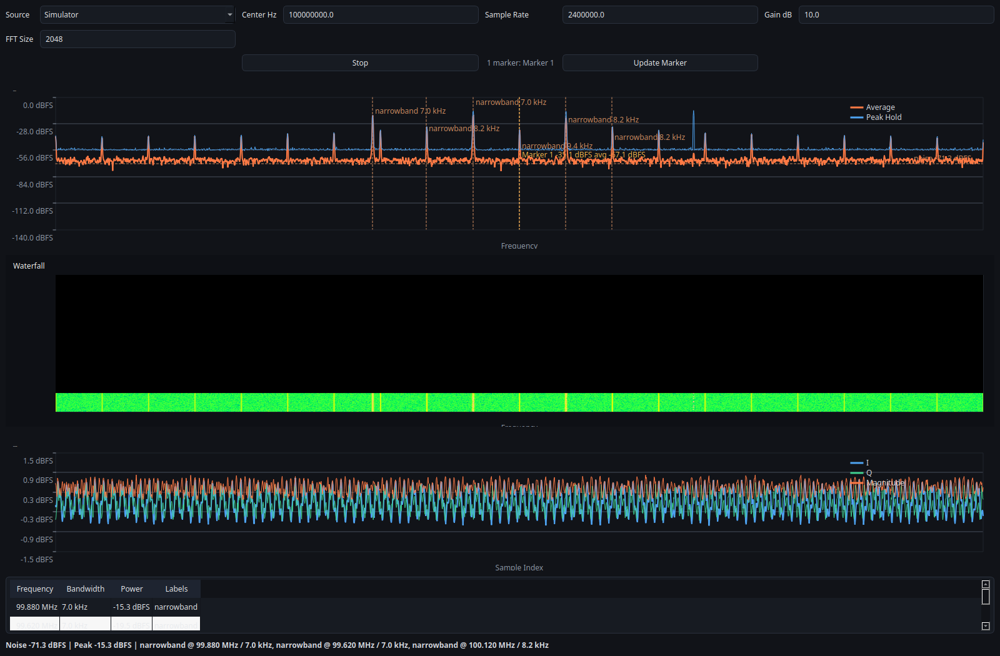

# SDR Signal Analyzer Docs

`sdr-signal-analyzer` is a C++-first SDR analysis stack with a Python GUI, deterministic replay, and optional live-device backends. The docs follow the same stable path recommended in the README: simulator, replay, `rtl_tcp`, then hardware-specific backends.

The canonical notation, code-symbol mapping, and terminology are documented separately so equations, code, and tests stay aligned.

*This screenshot is generated from the simulator-backed GUI and is meant for reproducibility and layout reference, not live RF validation.*

For marker editing, see the dedicated table-based dialog screenshot in [Case Studies and Screenshots](case-studies.md).

## Start Here

- [Notation Registry](notation.md) for the canonical symbol table
- [Verified Behavior](proof.md) for the shortest evidence path
- [Code-Symbol Mapping](code-symbol-mapping.md) for the code-to-symbol crosswalk
- [Terminology and Status Labels](terminology.md) for preferred wording and status labels
- [Architecture](architecture.md) for system layout and data flow
- [Public API](api.md) for the public C++ and Python surface
- [Trust and Limits](limitations.md) for heuristic labels and failure modes
- [Diagnostics](diagnostics.md) for runtime logging and bug-report evidence
- [Quality Evidence](quality-evidence.md) for reproducible artifacts and expected outputs
- [Replay and Recording](replay-and-recording.md) for deterministic capture workflows
- [Release Readiness](release.md) for maintainer release validation
- [Release Checklist](release_checklist.md) for the step-by-step cut process
- [Hardware Validation Plan](hardware_validation_plan.md) for attached-device lab preparation
- [Hardware Validation Status](hardware_validation_status.md) for backend status labels
- [Troubleshooting](troubleshooting.md) for common install and runtime blockers
- [Recommended Workflows](workflows.md) for the simulator-first path
- [Testing and Validation](testing.md) for regression coverage and validation scope
- [Source Guides](sources/index.md) for backend-specific notes
- [Case Studies and Screenshots](case-studies.md) for reproducible evidence

## Fast Paths

- On Ubuntu or Debian, install prerequisites with `sudo apt install -y cmake g++ libegl1 libxcb-cursor0 libxkbcommon-x11-0 ninja-build python3-dev`
- Install with `python -m pip install ".[gui]"`
- Run the demo with `sdr-signal-analyzer-demo`
- Run the simulator CLI with `sdr-analyzer-cli --source simulator --frames 20`
- Replay the committed fixture with `sdr-analyzer-cli --source replay --input tests/fixtures/tone_cf32.sigmf-data --meta tests/fixtures/tone_cf32.sigmf-meta --frames 4`
- Check the proof page when you need a repo-backed screenshot and exact replay result: [Verified Behavior](proof.md)

## Status Labels

- `Verified`: direct deterministic or mocked evidence exists in the repository now.
- `Prepared for validation`: protocol, commands, and templates are present.
- `Pending lab validation`: attached-device evidence has not yet been collected.
- `Experimental`: intentionally heuristic or exploratory behavior.
- `Not supported`: unavailable on the current platform or build.
